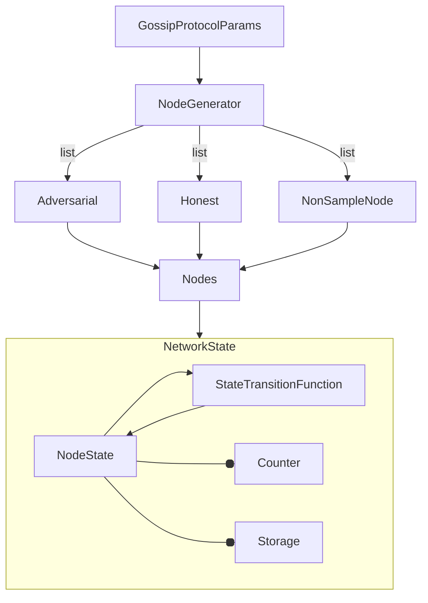

# synchronous-gossip-protocol

Python implementation of a synchronous gossip protocol. 




## Installation

```bash
git clone https://github.com/dineshpinto/synchronous-gossip-protocol.git
cd synchronous-gossip-protocol
poetry install --with dev
poetry run python -m ipykernel install --user --name=synchronous-gossip-protocol
```

## Usage

```bash
poetry run jupyter lab
```
